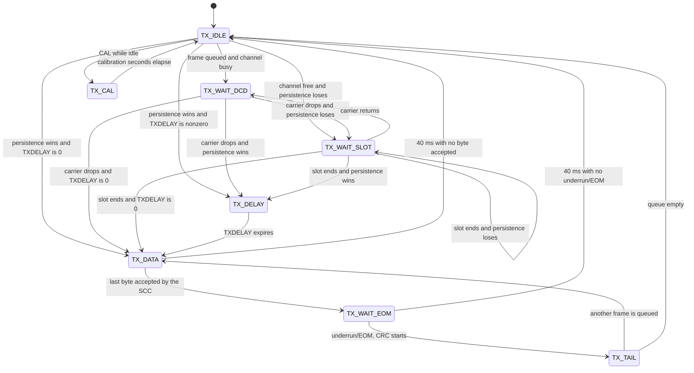

# Modem state machines

`src/modem.c` has one named transmitter state machine, `TxState`, and a receive path that moves a frame through two buffers. The main loop calls `logging_service` and `modem_service`. `modem_service` runs `tx_service` for every state except the ones the transmit interrupt advances. Channel A interrupts feed bytes, watch end-of-frame, and sample carrier.

Time is in 10 ms ticks. Twelve interrupts of the 1200 Hz `/SYNCB` input are one tick.

## Transmitter

`tx_state` starts at `TX_IDLE` from `modem_init`. `modem_send` queues a frame on the transmit queue and calls `tx_kick`, which leaves idle only when a frame is actually taken. A transmission already in progress stays there; that queue holds the new frame until the channel returns to idle, or until `TX_TAIL` takes the next frame without unkeying.

With `VISCOUS X Y` enabled, `digi_ingress` first puts a selected repeat in the
viscous queue. `digi_service` waits for its ordered expiry and takes one due
frame per call. It discards that frame when the duplicate database contains a
copy heard through another digipeater and logs the suppressed frame as `V`,
or moves it to the transmit queue due `10 - X` seconds later. The next due
frame waits for the next call. Only that promotion enters this transmitter
state machine.

PTT (`keyed`) is on from `tx_key` until `tx_release`. Calibration keys on its own and does not pass through the data states.

`FULLDUPLEX` skips the carrier checks. Those arrows go from idle straight to the persistence draw, and a draw that wins keys immediately.

### TX_IDLE

The radio is unkeyed and no frame is in the SCC. This is the only state that accepts a new frame from `tx_kick`, and the only state that accepts `CAL`.

`tx_kick` takes one frame off the transmit queue. A frame whose expiry second has been reached is discarded, counted as `!S`, and the next frame is taken. With the callsign unset it prints `ERR - Set Callsign`, throws away every frame still in that queue, and stays idle. Otherwise:

| Condition | Next |
|---|---|
| `FULLDUPLEX` is off and `dcd_now` is set | `TX_WAIT_DCD` |
| Channel is free, or `FULLDUPLEX` is on | Persistence draw (`tx_persist`) |

### TX_WAIT_DCD

A frame is waiting and the channel is busy. PTT is off. Each service pass stays here while `dcd_now` is set and `FULLDUPLEX` is off.

When carrier drops, or when `FULLDUPLEX` is turned on, the wait ends with a persistence draw. The slot timer is cleared so a later slot does not inherit an old countdown.

`tx_key` can return here without keying. It samples the live `/DCD` pin, not the shadow, and if carrier has come back it updates `dcd_now` and waits again.

### TX_WAIT_SLOT

The channel was free and the persistence draw lost. PTT is off. The slot timer is loaded with `SLOTTIME` ticks.

| Condition | Next |
|---|---|
| `FULLDUPLEX` is off and carrier returns | `TX_WAIT_DCD`, slot timer cleared |
| `SLOTTIME` is 0, or the slot timer expires | Persistence draw |
| Otherwise | Stay |

### Persistence draw

`tx_persist` is not its own state. It is the step out of idle, out of the DCD wait, and out of a finished slot.

`FULLDUPLEX` keys immediately. Otherwise a busy channel goes to `TX_WAIT_DCD`. On a free channel the firmware stirs the generator with the seconds clock and draws `prng_u8()`, a value from 0 to 255. The draw wins when it is less than or equal to `PPERSIST`, and the radio keys. A larger draw enters `TX_WAIT_SLOT`.

### TX_DELAY

PTT is on. The SCC is in flag idle, so it shifts HDLC flags until the first data byte is written. The underrun latch stays set; clearing it here would send a CRC instead of flags.

The timer is `TXDELAY` ticks, so 30 is 300 ms. At 1200 baud that is 12 bit times, 1.5 flags, per tick. When the timer expires, `tx_start_data` loads the frame. A `TXDELAY` of 0 skips this state and loads the byte from `tx_key`.

### TX_DATA

The transmit-empty interrupt is on. `tx_start_data` resets the TX CRC, writes `tx_buf[0]`, then resets the underrun latch so an empty buffer at the end of the frame sends CRC rather than an abort. `tx_i` is 1. The current flag finishes shifting before that byte goes on the air.

The transmit interrupt loads `tx_buf[tx_i]` and increments `tx_i` while `tx_i < tx_len`. One byte is about 6.7 ms at 1200 baud. When `tx_i` reaches `tx_len`, the last byte has moved into the shift register. The interrupt sets `TX_WAIT_EOM`, arms the underrun watch, and turns the transmit-empty interrupt off.

The service loop watches `tx_i`. Each new value restarts a 40 ms stall timer (`TX_WAIT_TICKS`). If `tx_i` does not change for 40 ms and the interrupt has not already moved on, the frame is aborted: PTT drops, the SCC is given the abort command, and the state returns to `TX_IDLE`. That transmission is not counted.

### TX_WAIT_EOM

The last data byte is in the shift register. CRC and the closing flags have not started yet. The underrun/EOM bit in RR0 is what marks the start of the 16-bit CRC, so this state waits for that bit.

The channel A external-status interrupt records the bit only while `tx_eom_watch` is set. The watch is off while the frame is being armed, because resetting the underrun latch also changes that status bit. The first service pass in this state starts the same 40 ms stall timer used in `TX_DATA`.

| Condition | Next |
|---|---|
| Underrun/EOM seen | `TX_TAIL`, 40 ms tail timer (`TX_TAIL_TICKS`) |
| 40 ms and the bit never sets | Abort, `TX_IDLE`, transmission not counted |

### TX_TAIL

The CRC transmission has started. The tail is 40 ms from that instant: 16 CRC bits are 13.3 ms and three flag bytes are 20 ms, which is 33 ms at 1200 baud. PTT stays on through those flags. The SCC then returns to flag idle on its own. This state does not write more bytes.

When the tail timer expires, `tx_continue` counts the frame as transmitted and logs it when logging is on. The next take removes one frame. A frame that is already due is counted as `!S` and left there; the frame behind it is taken on the next service pass. While idle, each `modem_service` likewise takes at most one queued frame.

| Condition | Next |
|---|---|
| Another transmit frame is queued and still inside its window, callsign still set | `TX_DATA` immediately. PTT stays on. `TXDELAY` is not repeated |
| The next frame is already due | Stay in `TX_TAIL` with PTT on. That frame is `!S`, and the next pass takes the one behind it |
| Transmit queue empty, or the callsign was cleared | `TX_IDLE`. PTT drops with no abort, because the CRC and flags are already going out. Frames still queued are discarded one per later idle pass |

A frame that finds the state idle later, including one queued after the unkey, takes the full path through persistence and `TXDELAY`.

### TX_CAL

A calibration tone. Entered from `TX_IDLE` while unkeyed, with the callsign set. Any other transmitter state prints `Busy` and stays put. An unset callsign prints `ERR - Set Callsign`.

PTT is on. The tone is high (2200 Hz), low (1200 Hz), or flags, for the requested seconds. `tx_service` does not touch this state. When the seconds counter reaches zero, `modem_cal_stop` drops PTT, restores NRZI flag idle, returns to `TX_IDLE`, and kicks the queue.

### Abort and unkey

`tx_unkey(false)` is the failure path from `TX_DATA` and `TX_WAIT_EOM`. It sends the SCC abort command, drops PTT, discards the receiver bytes captured while keyed, and then runs `tx_kick` so a later queued frame can start. The aborted frame is not counted.

`tx_release(false)` is the clean unkey from `TX_TAIL`. No abort command. The same receiver drain runs, because half duplex hears the station's own audio.

## Receiver

There is no receive enum. A frame is assembled in one buffer, and a finished frame occupies the other until the service loop takes it.

Bytes arrive from the channel A receive interrupt and the special-condition interrupt. Both drain the SCC FIFO through `rx_take`. While `keyed` is set and `FULLDUPLEX` is off, those bytes are the station's own transmission and are discarded. An end-of-frame or overrun on that audio resets the assembler.

### Assembling

`rx_len` is how many bytes are in `rx_buf[rx_fill]`. A byte is stored until the buffer reaches `AX25_MAX` (330). Further bytes set the overflow flag and are not stored.

An overrun resets the assembler and issues the SCC error reset. It does not finish a frame. An abort seen on the external-status interrupt does the same reset.

### End of frame

`RR1` end-of-frame ends the attempt. The two CRC bytes are still in the count. The frame is kept only when all of these are true:

- the buffer did not overflow
- `RR1` reports no CRC error
- the residue code is `RR1_RESIDUE_OK` (`0x06`), meaning the closing flag landed on a byte boundary
- the length after removing the two CRC bytes is at least `AX25_MIN` (15)

A kept frame counts as a received packet and arms the STA lamp. Any other ending is discarded. Either way the assembler length returns to zero and the SCC error latch is reset.

### Holding

A kept frame is published by setting `rx_ready`, remembering which buffer and which length. `rx_fill` switches to the other buffer so the next frame can assemble while the service loop still owns the first.

If `rx_ready` is already set, the new frame is not stored. `rx_dropped` increments, and `drop_service` later prints `!R` and counts an adverse drop. A drop counter that is already 65535 reboots instead of incrementing.

### Delivered

`service_rx` runs once `rx_ready` is set. A frame with no source callsign is logged as `D` when logging is on, then dropped, and `rx_ready` clears. A normal frame is passed to `digi_ingress`, which copies it into the digipeater workspace and clears `rx_ready` before logging it as `R` or deciding whether to repeat it. A frame that arrives during that decision can occupy the slot again. `service_rx` clears `rx_ready` only when the copy did not happen.

`src/logging.c` keeps the trace text. The main loop calls `logging_service`, which sends one queued byte when the terminal transmitter is idle. A new line does not wait for the previous one to finish, and a busy ring is not an adverse drop. When 240 bytes are still queued, the ring writes `!!!` and discards further trace text until 128 bytes or fewer remain.
